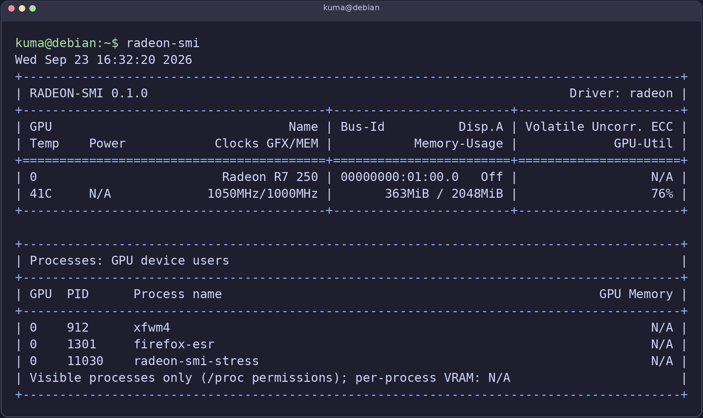

# radeon-smi

**SMI-style monitoring for legacy AMD Radeon GPUs.**



`radeon-smi` is a small, read-only Linux command-line tool for GPUs using the
open-source `radeon` kernel driver. It presents a familiar GPU summary and
supports selected `nvidia-smi` query and loop options. It focuses on older
Radeon GPUs; newer GPUs already have AMD SMI and ROCm SMI.

The program reads Linux DRM query ioctls and sysfs directly. It does not need
ROCm, a daemon, a privileged helper, or a compiler on the machine where a
prebuilt binary is installed.

## Install

Download the latest assets from [GitHub Releases](https://github.com/kuma-loong/radeon-smi/releases).

### Debian or Ubuntu

```sh
sudo apt install ./radeon-smi_<version>_amd64.deb
```

### Portable archive

```sh
tar -xzf radeon-smi-<version>-linux-x86_64.tar.gz
install -Dm755 radeon-smi-<version>-linux-x86_64/radeon-smi "$HOME/.local/bin/radeon-smi"
```

Ensure `$HOME/.local/bin` is in your `PATH`. The release binary targets
x86-64 Linux with glibc 2.31 or newer; it does not require `libdrm` at runtime.

### Build from source

Source builds require Rust 1.70 or newer and a Linux C linker:

```sh
git clone https://github.com/kuma-loong/radeon-smi.git
cd radeon-smi
cargo build --release --locked
install -Dm755 target/release/radeon-smi "$HOME/.local/bin/radeon-smi"
```

`Cargo.lock` is committed for reproducible application builds. The only Rust
dependency is `libc`.

## Usage

```sh
radeon-smi
watch -n 1 radeon-smi
radeon-smi -L
radeon-smi -i 0000:01:00.0 -q
radeon-smi --query-gpu=name,pci.bus_id,temperature.gpu,memory.used,utilization.gpu --format=csv
radeon-smi --query-gpu=timestamp,utilization.gpu --format=csv,noheader,nounits -l 1
```

`-l SEC` and `-lms MS` continuously print snapshots. `watch` is the standard
external Linux command and is not part of `radeon-smi`. Run
`radeon-smi --help-query-gpu` for the complete field list. Unsupported
hardware fields return `N/A`; unknown query field names are errors.

## Permissions

The tool first opens a matching `/dev/dri/renderD*` node. On most Linux
systems, the user needs access to the `render` group. For example:

```sh
sudo usermod -aG render "$USER"
```

Log out and back in after changing group membership. If a GPU has no render
node, the tool tries its `/dev/dri/card*` node. DRM authentication and device
permissions may prevent telemetry in that case, especially over SSH. The tool
still displays data available from sysfs and marks unavailable fields `N/A`.
The installer never changes group membership or device permissions. The
program does not use setuid, `/dev/mem`, or write ioctls.

## Scope and limitations

The initial implementation supports Linux `radeon` DRM devices. It has been
tested on an Oland/Radeon R7 250 with Debian 12. GPU utilization is the
percentage of samples where the graphics busy bit is set during a 200 ms
window. Older drivers or GPU families may not expose this register through
the query ioctl; utilization then appears as `N/A`.

VRAM values are device-wide. The Processes section finds visible processes
with open GPU device files in `/proc/<pid>/fd`. This identifies GPU device
users, not whether each process is actively submitting work. Linux `/proc`
permissions may hide other users' processes; running as root can show more,
but is not required for GPU telemetry. The legacy `radeon` driver does not
expose reliable per-process GPU memory or utilization accounting, so
per-process memory is shown as `N/A`. Power is read only when a hwmon sensor
is available. The default table omits MIG and compute mode. It retains an
ECC field, shown as `N/A` when the driver exposes no ECC counter; this does
not imply that every older Radeon GPU lacks ECC hardware. The header shows
the actual kernel driver (`radeon`). This tool does not control clocks, power,
fans, or driver settings.

## Development

```sh
cargo fmt --check
cargo clippy --all-targets --locked -- -D warnings
cargo test --locked
cargo build --release --locked
```

Release tags use `vMAJOR.MINOR.PATCH`. GitHub Actions builds the archive and
Debian package from a pinned, older Linux environment so users can install
without a compiler. See [CONTRIBUTING.md](CONTRIBUTING.md).

## License

Apache License 2.0. See [LICENSE](LICENSE).
